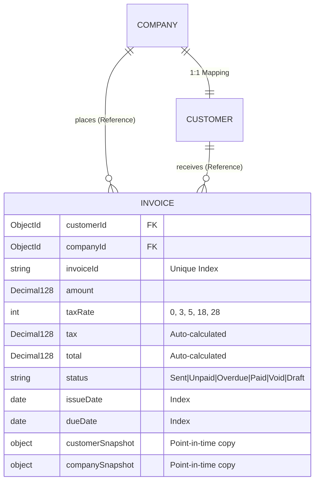

# Invoicing System Backend

A production-grade, highly scalable backend for managing customer invoicing, designed using **Node.js (Express)**, **MongoDB (Mongoose)**, and conforming to strict financial auditability and indexing standards.

---

## Technical Architecture & Database Design

### 1. The Scaling Rationale
In a naive database design, invoices are stored as flat documents (like the raw JSON file). While simple, flat models suffer from massive data redundancy, lack of validation, and high risk of data inconsistency. 

However, fully normalizing the data (referencing a `Customer` and a `Company` by their database IDs alone) has a severe production vulnerability: **Invoices are legal and audit documents and must remain immutable**. If a customer updates their company name or billing address next year, all past invoices *must not* retroactively change to show the new details.

To solve this, this backend implements a **Hybrid Schema (Normalized References + Immutable Snapshots)**:
- **`Company` Collection**: Master record for the company entity.
- **`Customer` Collection**: Master record for the customer, maintaining a `1:1` mapping to their current `Company`.
- **`Invoice` Collection**: Stores references (`customerId`, `companyId`) to the active master records for analytical indexing and fast relationship querying, but also embeds **point-in-time snapshots** (`customerSnapshot`, `companySnapshot`) of the entities. This guarantees legal auditability and immutability.



### 2. High-Precision Financials
JavaScript's native IEEE 754 floating-point numbers are prone to rounding errors (e.g., `0.1 + 0.2` evaluates to `0.30000000000000004`). In financial systems, this is unacceptable.
- We utilize MongoDB's **`Decimal128`** type via Mongoose for the `amount`, `tax`, and `total` fields.
- **Validation Hooks**: Mongoose pre-validate hooks enforce mathematical integrity by auto-calculating `tax` (based on `amount * taxRate / 100`) and `total` (based on `amount + tax`), rounding both values to exactly 2 decimal places.
- **Client Serialization**: Since `Decimal128` returns a complex object via JSON by default (e.g. `{ "$numberDecimal": "123.45" }`), custom Mongoose transformations are configured to output clean floats in the JSON response automatically, ensuring backend precision with frontend ease of consumption.

### 3. Indexing Strategy
To support rapid dashboard rendering and range searches, we implement the following indexes:
- `{ invoiceId: 1 }` (Unique): Ensures no duplicate invoices can be created.
- `{ status: 1, issueDate: -1 }` (Compound): Speeds up dashboard filtering by status and sorting by issue date.
- `{ customer: 1, issueDate: -1 }` (Compound): Speeds up rendering of a customer's invoice history.
- `{ amount: 1 }`: Speeds up sorting by invoice value.
- `{ dueDate: -1 }`: Speeds up sorting by due dates.

---

## API Documentation

All API endpoints are prefixed with `/api`.

### 1. Invoices
- **`GET /api/invoices`**: Returns paginated, sortable, and filterable invoices.
  - **Query Parameters**:
    - `page` (default: `1`)
    - `limit` (default: `10`)
    - `sortBy` (options: `amount`, `dueDate`, `issueDate`, `invoiceId`; default: `issueDate`)
    - `sortOrder` (options: `asc`, `desc`; default: `desc`)
    - `status` (options: `Sent`, `Unpaid`, `Overdue`, `Paid`, `Void`, `Draft`)
    - `customer` (Accepts customer ID or a case-insensitive name search string)
    - `issueDateStart`/`issueDateEnd` (ISO range: `YYYY-MM-DD`)
    - `dueDateStart`/`dueDateEnd` (ISO range: `YYYY-MM-DD`)
- **`POST /api/invoices`**: Creates a new invoice. Recalculates tax/total and extracts snapshots from database references automatically.
  - **Body**:
    ```json
    {
      "invoiceId": "INV-100203",
      "customer": "6a22ae7d8ef0b8ab883a4fb9",
      "amount": 1250.50,
      "taxRate": 18,
      "status": "Unpaid",
      "issueDate": "2026-06-05",
      "dueDate": "2026-07-05"
    }
    ```
- **`PUT /api/invoices/:id`**: Updates an existing invoice. If the customer reference changes, the backend automatically resolves company association and updates the snapshots.

### 2. Customers
- **`GET /api/customers`**: Returns a list of all customers with company references (used to populate selectors).
- **`GET /api/customers/top-five`**: Returns the top 5 customers aggregated by cumulative sales value. Utilizes a high-performance MongoDB aggregation pipeline.
- **`GET /api/customers/:id`**: Returns a customer's details, active company, summary metrics (cumulative billed, paid, and unpaid totals), and full invoice history sorted chronologically.

---

## Installation & Setup

### Prerequisites
- Node.js (v16+)
- A MongoDB cluster (URI provided in the `.env` file)

### Installation Steps
1. Navigate to the `Backend` directory:
   ```bash
   cd Backend
   ```
2. Install dependencies:
   ```bash
   npm install
   ```

### Running the Seed Script
To populate the database with the provided 2000 invoice dataset, run the following:
```bash
node seed.js
```
The script will clear any existing records and perform bulk insertions of companies, customers, and invoices.

### Running the Express Server
To start the backend server in development mode:
```bash
node server.js
```
The server will start running on port `5000` (or the port specified in `PORT` env variable).
